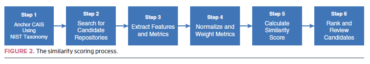
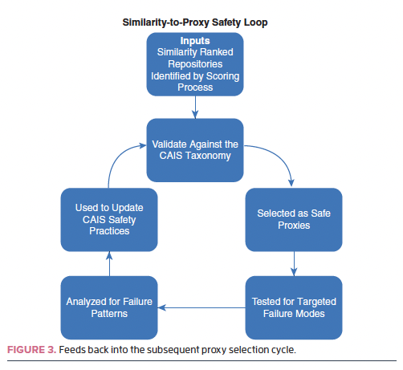

# Proxytool: Metadata-Driven Proxy Discovery for Critical AI Systems (CAIS)

This repository contains an executable implementation of the paper:
Kennedy, DeFranco & Laplante (IEEE Computer, 2026),
“Discovering Proxy Systems to Test Critical AI Systems: A Metadata-Driven Software Similarity Approach”.

## Abstract
Proxytool helps discover and rank open-source proxy systems for Critical AI Systems (CAIS) when direct source code access is restricted.
It computes a composite similarity score from GitHub metadata (commit semantics, contributor behavior, file-change histories, and temporal evolution),
then validates candidate rankings using a NIST-style CAIS taxonomy alignment and a scenario-driven safety loop.

## 1) Introduction / Motivation
When source access is unavailable (proprietary, regulated, or restricted), teams still need safety-oriented evidence.
The paper argues that proxy selection should be grounded in *behavioral fingerprints* and *taxonomy-aligned similarity*—not superficial resemblance.

## 2) Paper-to-Code Mapping (high level)
The notebook implements the paper’s six-step process (Figure 2) and the Similarity → Taxonomy validation → Proxy test planning safety loop (Figure 3):

- **Figure 2 (pipeline):** discovery → feature extraction → normalization → similarity scoring → ranking → validation

- **Figure 3 (safety loop):** taxonomy-aware reporting → scenario-based test planning mapped to indicator families

## 3) Method (Paper Figure 2: Six-Step Process)
Run `proxytool.ipynb` for the full end-to-end workflow.

### Step 1 — Anchor CAIS profiles
- Loads per-domain CAIS profile configuration (NIST 5D-style dimensions) in `CAIS_DOMAIN_CONFIGS`.

### Step 2 — Discover candidates
- Candidate repos are sourced from GitHub discovery queries and/or configured candidate lists.
- Primary entry point: `run_discover_and_compare(...)`.

### Step 3 — Extract behavioral fingerprints
Proxytool builds four indicator families:

1. **Commit semantics** (intent/sentiment, plus embedding when `sentence-transformers` is available)
2. **Contributor behavior** (collaboration and authorship graph signals)
3. **File change histories** (co-change and churn signals from commit numstat + file trees)
4. **Temporal evolution** (development rhythm and cadence/burstiness)

### Step 4 — Normalize & weight features
- Features are scaled via a normalizer and combined with paper-aligned weights (`CAIS_WEIGHTS` / weight tuning helpers).

### Step 5 — Similarity score & ranking
- Similarity is computed via cosine similarity over the weighted feature vectors.

### Step 6 — Taxonomy-aware validation
- Proxy selection reports **overall** vs **taxonomy-only** similarity, making taxonomy alignment explicit.
- Key helpers: `compare_taxonomy_vs_standalone(...)`, `_taxonomy_similarity_report(...)`.

## 4) Similarity → Safety Loop (Paper Figure 3)
The notebook includes scenario-driven test planning by mapping failure-mode scenarios back to indicator families.

- Scenario construction: `CAIS_TEST_SCENARIOS`
- Plan generation: `plan_proxy_tests(...)`
- Human-readable output: `print_proxy_test_plan(...)`

## 5) Experimental Evaluation (How results are produced)
The repo supports multiple evaluation modes:

- **Domain vs Control separation**: how a CAIS “peer set” differs from controls
- **Taxonomy vs standalone**: compare accuracy under taxonomy-augmented similarity
- **Side-by-side code baselines** (where code is available): `side_by_side_comparison(...)`

Outputs:
- `results_plots/`: saved experiment visualizations
- `validation_results.csv`: evaluation summaries
- `analysis/`: generated recommendation artifacts (e.g., recommendations derived from taxonomy PDFs)

## 6) How to Run
1. Set a GitHub token:
   - `export GITHUB_TOKEN=...`
2. Install dependencies (not all are required for every run):
   - `pip install requests tqdm matplotlib ipython scipy sentence-transformers vaderSentiment`
3. Open and execute:
   - `proxytool.ipynb`

Note: deep semantic embedding signals depend on `sentence-transformers`. If it isn’t installed, the notebook falls back gracefully.

## 7) Repository Layout
- `proxytool.ipynb`: canonical research pipeline (discovery → similarity → evaluation → test planning)
- `scripts/proxy_doc_analyzer.py`: generates recommendation signals from taxonomy PDFs
- `results_plots/`: curated visuals for analysis and comparisons
- `analysis/`: generated artifacts (optional)

## Links / References
- `Discovering_Proxy_Systems_to_Test_Critical_AI_Systems_A_Metadata-Driven_Software_Similarity_Approach.pdf`
- `IEEE PROOF Computer Software Column - v2.pdf`
- `NIST.CSWP.31.pdf`
- `A_Taxonomy_of_Critical_AI_System_Characteristics_for_Use_in_Proxy_System_Testing.pdf`
- `CAIS-NIST.docx`